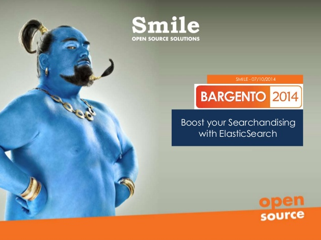

About this module :
===================
This module provides an integration of ElasticSearch into Magento developed by the R&D to address a lot of shortcomings met with the native SolR integration shipped with Magento EE :

* Fulltext search improvement (fuzzy text query, …)
* Rich autocomplete (products, categories,  …)
* Highly tunable scoring features
* Relevancy using behavior of the customers (Not yet released OpenSource)
* Integration of all Smile experience about search solutions (e.g. : Virtual Categories, multiple select facetting, …)

You can find more information in our slideshare slides :

Documentation :
===============

* [Installing the module](doc/install.md)
* [User documentation](doc/user-documentation.md)
* [Developper documentation](doc/developper-documentation.md)
* [Behavorial search documentation](doc/behavorial-search.md) (Not yet released OpenSource)
* [Indexing custom content](doc/indexing.md)

FAQ
===

Why choosing ElaticSearch instead of extending the SolR implementation shipped with Magento EE ?
------------------------------------------------------------------------------------------------
First, ElasticSearch contains a lot more useful features needed to achieve some features of the project :

* Query language is more complete and allow us to build very complex use case models
* Rescoring used for behavioral content
* Ability to store many types of content into the same index (products, categories, ...)

Into the future we plan to use even more features specific to ElasticSearch (percolation, aggregation), since they are very valuable into an eCommerce context.

In the end ES has a lot of advantages over SolR :

* A strong momentum with a community providing a lot of support and extensions to the core offer
* Supported by a commercial company
* Very well documented (http://www.elasticsearch.org/guide/en/elasticsearch/reference/current/) !!!
* Built for distributed environnement, making it easier to scale it up for our biggest clients
* Built with replication features out of the box ensuring more stability for the websites using the engine

Who is supporting the module ? What about upgradability ?
-------------------------------------------------------

Smile is supporting the module and ensure it is compatible with new Magento versions.
The kind of feature we provide requires usually an external tool (FredHopper, ...) which requires a project by project upgrade which can take longer.

Our main idea is to create a community of clients sharing investment and evolutions about searchandizing features.

What is the project roadmap ?
-----------------------------

* More user behavior influence
* Promotional rules influence on the search engine, Search engine based distance to promotion.
* More website animation features to achieve a full searchandising suite
* Showcases based on widgets
* Banners selection
* Stamping based on rules (new product, special price, ...)
* Marketing facets
* Recommandations

What Magento version is supported ?
-----------------------------------

The module has been successfully deployed and tested against the following Magento versions :
* Magento EE 1.13
* Magento EE 1.14
* Magento CE 1.8
* Magento CE 1.9

Can I install it on my existing project ?
-----------------------------------------

If your project is using Magento EE >= 1.13 or Magento CE >= 1.8, the time you will need depends only on the amount of custom developments you spent on SolR onto the project. The custom developments can be separated in two parts :

* Custom development replaced by new features of Magento ElasticSearch module (multiple facets, virtual categories, ...). You should disable this features into your old project and adapt the new version to you specific needs
* Other features, you should be able to port with a very moderated effort (1 day / feature).

If your project does not rely on SolR to achieve developments, the migration project should not be more than a few days project.

For older version of Magento, an evaluation should be done for your specific project.

Bugs / RFC
----------

Don't hesitate to :

* Submit a bug, RFC, idea of new feature
* Submit a merge request

