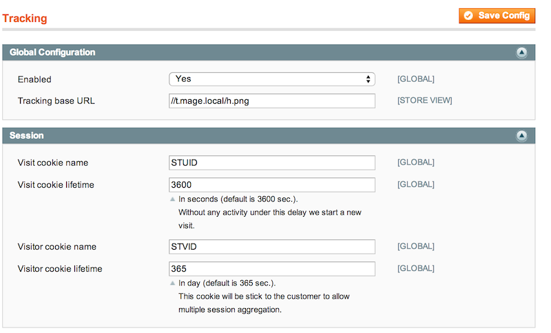
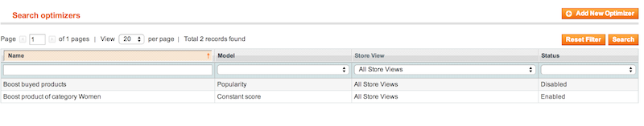
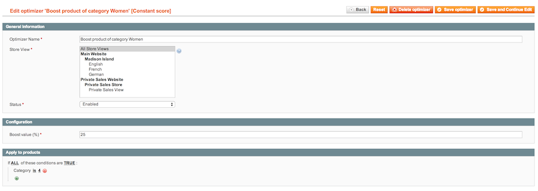
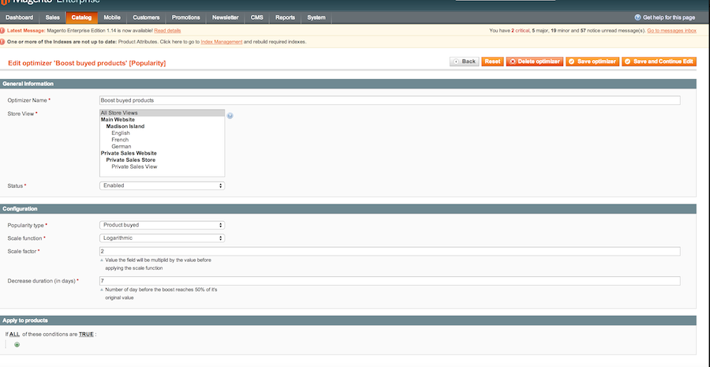

Behavorial Search Features
==========================

The module comes with mechanism which allows the engine to analyze behavior of the users of the website to modify search results scoring.

This section explains how to configure this feature and extend the available models.

Data collector
--------------

### Prepare ElasticSearch

In order to make the feature working, you will need to install the ES tracking indexer shipped with the module (es/plugins/tracking-indexer/tracking-indexer-current.jar).

The module is normally installed with ES if you have used the automated install script (see [Installing the module](install.md)). 

You can check the module is correctly installed by running the following command from the shell :

```bash
/usr/share/elasticsearch/bin/plugin --list
```

If not installed, you can rerun the install script after you have check you have the last version of the module.
You can also run the following command to install the plugin from the source :

```bash
/usr/share/elasticsearch/bin/plugin -i tracking-indexer -u file:///SOURCE_ROOT/es/tracking-indexer/tracking-indexer-current.jar
```

When installed the http://localhost:9200/tracker/hit URL of the search engine should respond with an empty PNG image and the search engine is ready to index events sent through this URL.

> **Note :** 
> When using SPBuilder, make sure the es directory of your project is part of your delivery package. It is not the case bu default, but you can add the path to the svn-components (More details at https://wiki.smile.fr/view/Dirtech/Projets/SpBuilderProperties)

### Apache configuration

You will need a new domain name to collect tracking.

For a site named **www.mysite.com**, you can use a new domain called **t.mysite.com** or **hit.mysite.com** by example.
 
This domain will be proxied to ES tracking plugin through an Apache vhost :

``` conf
<VirtualHost *:80>

    ServerName t.mysite.com

    ProxyPreserveHost On
    <Proxy balancer://esnodes>
      BalancerMember http://localhost:9200/tracker/hit
      # Place all your ES nodes as balancer member
      # If you have 2 nodes (es.node1.mywebsite.com and es.node2.mywebsite.com),
      # you will have the following configuration :
      #
      # BalancerMember http://es.node1.mywebsite.com:9200/tracker/hit
      # BalancerMember http://es.node1.mywebsite.com:9200/tracker/hit
    </Proxy>

    RewriteEngine On
    RewriteRule (.*) balancer://esnodes [P]
    
    ErrorLog  /var/log/apache2/smile-tracker.log
    CustomLog /var/log/apache2/smile-tracker.log combined
    
</VirtualHost>
```

Before restarting apache, ensure the required Apache modules are correctly loaded :

```bash
a2enmode proxy proxy_http proxy_balancer headers
```

> **Note :**
> * If using Varnish, you have to exclude the hit domain from the cache.
> * If using SSL on your website, you will need **to duplicate this configuration on the SSL port (443)** in order your website respond to https://t.mysite.com correctly. **You will need a valid certificate for this domain.**
> * Use the same domain name for SSL and non-SSL (a limitation into the tracking module does not allow different domain name).


### Smile Tracker

The Smile_Tracker module is shipped with the ES install. This module is in charge of tagging pages of the website with small PNG image with relay information about customer navigation to the newly created Apache vhost.

The only thing, you have to do is configuring the URL of your tracker.
This configuration can be found into **System > Configuration > Smile Searchandising Suite> Tagging** :



|Param|Description|
|-----|-----------|
|Tracker Base Url|The URL of the Apache proxy. <br/> Use an any png suffix (h.png, hit.png, ...). <br /> Prefer URL relative protocol with // (http://www.paulirish.com/2010/the-protocol-relative-url/) especially if using a website with SSL.|
|Cookie params|Cookies can be adjusted to change the duration of the session or of the visitor identification. Their name can be changed (not recommended) to avoid collision with other cookies.|


Optimizer models
----------------

Once the data collect is installed, you can use the optimizer module.
The purpose of this module is to apply custom scoring models to search.

You can access the optimizers though **Catalog > Search > Optimizers** and will found a list of all optimizers applied on the website :



> **About applying optimizer on the categories list**
>
> There is a regression in ES (https://github.com/elasticsearch/elasticsearch/issues/6788), which preventing using the rescorer on categories.
> The bug will be fixed in a future release and updating ES will apply optimizer as a secondary sort on category product list (after the position of the product chosen by the admin).

At this time two model of optimizer are available :

* **Constant Score**
* **Popularity**

### Constant Score Optimizers



> **Description :** This model apply a a boost defined in percent by the admin to a selection of products.

### Popularity Optimizers



> **Description :** This model give a boost to product according to their popularity. Value of the boost is computed using the params below

|Param|Description|
|-----|-----------|
|Popularity type|The type of event that will be counted to determine popularity : number of sales or number of views|
|Scale function|The function that will be applied to the number of sales / views. Most of time, use logarithm (log10) is the best model and avoid product to be overrated|
|Scale factor|A multiplication factor applied to the count before applying the scale function. <br />Use low scale factor for views (0.1) and higher for sales (10)|
|Decrease duration (in days)|Every day, the count is decreased by a small amount. This param set the number of day before the count reaches 50% of it's value|

**Exemples :**

|scale function |scale factor|Count = 10|Count=100|Count = 1000|
|---------------|------------|----------|---------|------------|
|log            |           1|         1|        2|           3|
|log            |          10|         2|        3|           4|
|log            |         0.1|         1|        1|           2|
|sqrt           |           1|       3.1|       10|          31|
|sqrt           |          10|        10|       31|         100|
|sqrt           |         0.1|         1|      3.1|          10|
|linear         |           1|        10|      100|        1000|
|linear         |          10|       100|     1000|       10000|
|linear         |         0.1|         1|       10|         100|

### Custom Optimizer Development

You can develop your own model in your module by implementing a class inherited **Smile_SearchOptimizer_Model_Optimizer_Abstract** and by appending it to the config :

**Example :**

The constant score implementation :

``` php
class Smile_SearchOptimizer_Model_Optimizer_ConstantScore extends Smile_SearchOptimizer_Model_Optimizer_Abstract
{
    /**
     * @var string
     */
    protected $_name = 'Constant score';

    /**
     * Append model configuration to the form.
     *
     * @param Varien_Data_Form                      $form      Form the config should be added to.
     * @param Smile_SearchOptimizer_Model_Optimizer $optimizer Current optimizer.
     *
     * @return Smile_SearchOptimizer_Model_Optimizer_Abstract Self reference.
     */
    public function prepareForm($form, $optimizer)
    {
        parent::prepareForm($form, $optimizer);

        $fieldset = $form->getElement('model_config_fieldset');

        $fieldset->addField(
            'config_boost_value',
            'text',
            array(
              'name'      => 'config[boost_value]',
              'label'     => Mage::helper('smile_searchoptimizer')->__('Boost value (%)'),
              'title'     => Mage::helper('smile_searchoptimizer')->__('Boost value (%)'),
              'required'  => true
            )
        );
    }

    /**
     * Apply the model to the query.
     *
     * @param Smile_SearchOptimizer_Model_Optimizer $optimizer Current optimizer.
     * @param array                                 $query     Query to optimize.
     *
     * @return array The modified query.
     */
    public function apply($optimizer, $query)
    {
        $boostFactor = 1 + ((float) $optimizer->getConfig('boost_value') / 100);
        $rescoreQuery = array(
          'function_score' => array(
             'boost_factor' => $boostFactor,
             'boost_mode'   => 'replace'
          )
        );

        $filterRuleSearchQuery = $optimizer->getFilterRuleSearchQuery();

        if ($filterRuleSearchQuery !== false) {
            $rescoreQuery['function_score']['filter'] = array(
              'query' => array('query_string' => array('query' => $filterRuleSearchQuery))
            );
        } else {
            $rescoreQuery['function_score']['query'] = array('match_all' => array());
        }

        $query['body']['rescore'][] = array(
          'window_size' => 1000,
          'query' => array(
            'rescore_query' => $rescoreQuery,
            'score_mode'    => 'multiply'
          )
        );

        return $query;
    }
}
```

It's declaration into config.xml :

``` xml
<config>
   <global>
       <smile_searchoptimizer>
            <optimizer_models>
                <constant_score>smile_searchoptimizer/optimizer_constantScore</constant_score>
            </optimizer_models>
       </smile_searchoptimizer>
   </global>
</config>