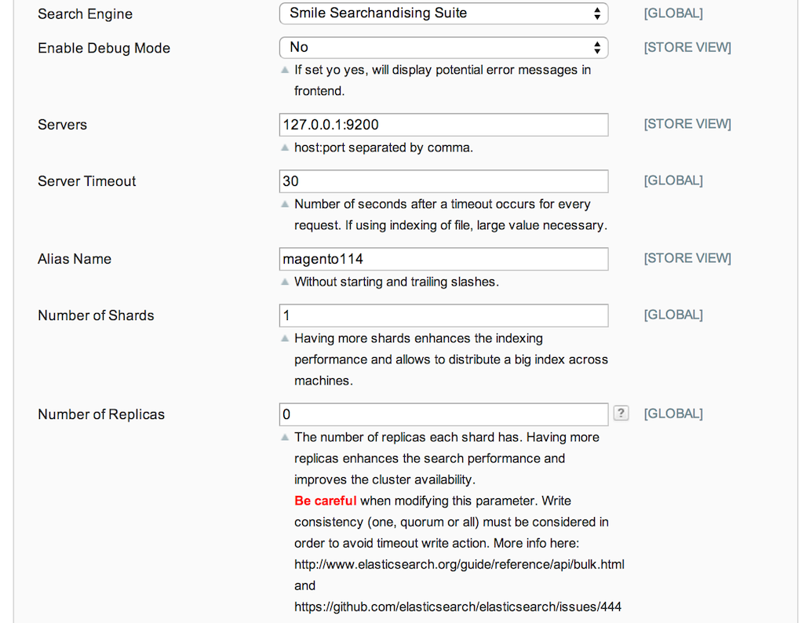

Install
=======

:angry_face:  **Whenever possible, you must install the module and all it's requirement during the technical kickoff of the project (at the same time you install Magento). Doing so, your developer will have no adaptation to handle ES specificity**


Installing ES
-------------

The module comes with a script which can handle ElasticSearch 1.2 install for you.

Install steps :

* Install the module into Magento
* You can find the script into **scripts/install/install-es.sh**

You need to choose a name for your cluster. You can use the name of your project as name for your cluster.

Then you can run the installer :

```bash
./install-es.sh cluster_name localhost:9200
```

If you want to install ES on several nodes, you need to modify the setup command in the following way (fqdn = Full Qualified Domain Name, the address of the node) :
```bash
./install-es.sh cluster_name node1.fqdn:9200 node2.fqdn:9200 node3.fqdn:9200
```

One the installer have finished, you should be able to access the engine at this address : http://localhost:9200/_plugin/head.

:angry_face: **The command should be run on every nodes.**

> **What is the installer doing ?**
> The installer proceed to ElasticSearch and all the required dependencies install from the ES official repositories.
>
> It also applies configuration specifics :
> * Unicast discorvery mode with list of nodes (usefull into firewalled environments)
> * Enable MVEL scripting (used by the module)
> * Set the logging to the correct level for production
>
> Additionally it does install the following plugins :
> * Head plugin : a lightweight admin plugin for ES
> * ICU plugin : a plugin which support internationalization enhancement for ES used by the Magento module 

The following port are used by default by ES and should be open :

|Port|Description|
|-----|-----------|
|9200 |This port is used to communicate with ES through it's REST API.<br />It should be allowed to access this port from front and from other ES nodes|
|9200 |This port is used to between ES nodes. If you plan a multiple nodes install dont't forget to open this port for every other nodes.|


Installing the module
---------------------

The Magento module does not require a particular installation but deploying the code.

**Warning :** The module disables SolR integration shipped with Magento EE. You will not be able to rely on it's feature. It is not a problem since ElasticSearch replicates them.


Module configuration
--------------------

To configure the module you will need to access the admin into **System > Configuration > Catalog > Catalog Search **.
You first need to make sure that the **Search Engine** param is set to **Smile Serchandizing Suite**.

Then the following options are availables :



|Param|Description|
|------|----------|
|Enable Debug Mode|Display debug message on front office. Default = off|
|Servers|List of ElasticSearch nodes the plugin should try to connect. Default : localhost:9200|
|Timeout|Timeout to realize on operation. Should be raised only if indexing huge catalog (> 1 millions products )|
|Alias name|**This is the most important part of the configuration especially if you have several instance of Magento on the same ES server. <br /> It is the name of the index that will be used by your Magento instance.**<br /> If you have two instance of Magento name of the alias should be different (magento-dev and magento-staging by example).|
|Number of shards, Number of replicas|Sharding and replication management <br />. You can have more info about this at : http://www.elasticsearch.org/guide/en/elasticsearch/reference/current/docs-index_.html|

Once everything is finished you can proceed to full reindex of your magento search engine. 

In Magento EE 1.14, the search engine reindexing is no more present into the admin and you have to proceed by the shell command :

```bash
php shell/indexer.php reindexall
```


> **Notes :**
> * A lot of the settings present here are environment related and should be included in your environment reconfiguration process.
> It has not yet been decided but it would be a good idea to move this settings to local.xml files just like the database or the cache.
> * You have to be sure your cron are correctly set up when using Magento EE 1.14 since it is the process in charge of reindexing data when index is invalidated and you have no access to reindexing from admin.
> * On Magento EE 1.13 a bug is present when adding / removing product from a category. It is not ES related. For more information : https://askbot.smile.fr/question/588/magento-1131-indexing-problem/
